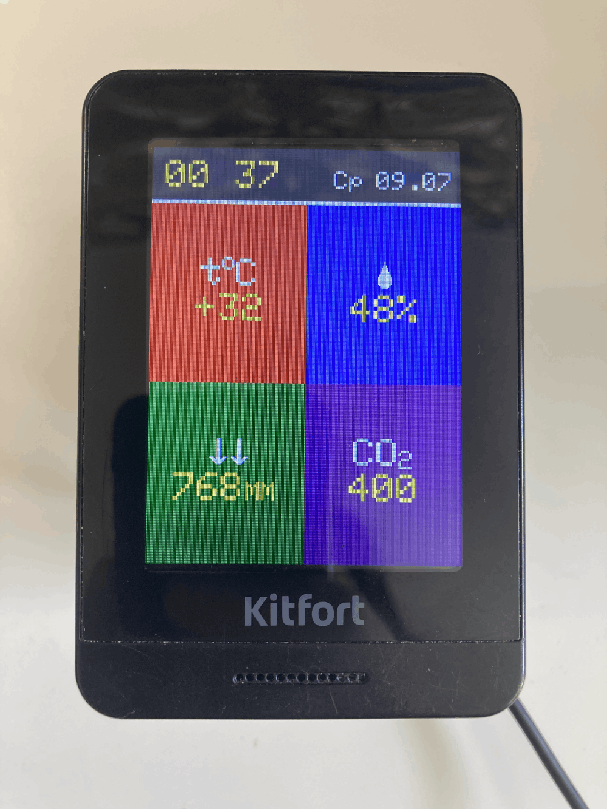
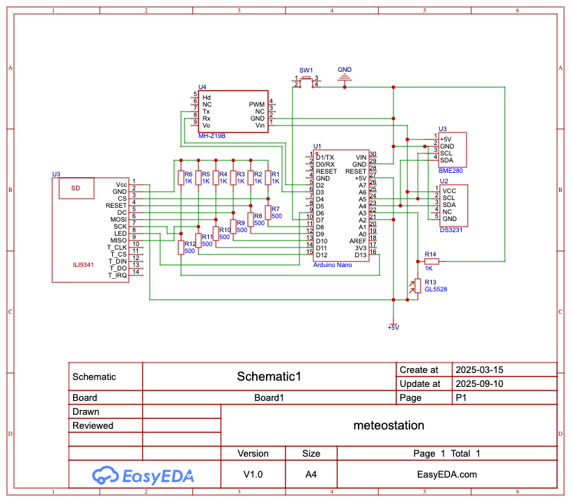

# Часы-метеостанция

Основано на проекте Алекса Гайвера https://alexgyver.ru/meteoclock/

## Основные фичи проекта
- Часы и календарь на русском языке
- Измерение температуры, атмосферного давления, влажности и уровня CO2
- Вывод информации с датчиков на цветной TFT-экран с разрешением 320x240 пикселей
- Автоматическая подстройка яркости экрана в зависимости от яркости освещения
- Кратковременное увеличение яркости экрана до максимума по нажатию кнопки

## Комплектующие
- Микроконтроллер Arduino Nano
- Датчик углекислого газа MH-Z19B
- Датчик температуры и влажности BME280
- Модуль реального времени DS3231
- TFT-экран 3.2 дюйма на чипе ILI9341
- Фоторезистор GL5528

## Библиотеки
- Adafruit GFX v1.12.1
- Adafruit ILI9341 v1.6.1
- Adafruit RTClib v1.2.0
- AlexGyver GTimer v1.0.7
- Adafruit Sensor v1.1.15
- Adafruit BME280 v1.0.7
- MHZ19_uart

## Схема подключения

