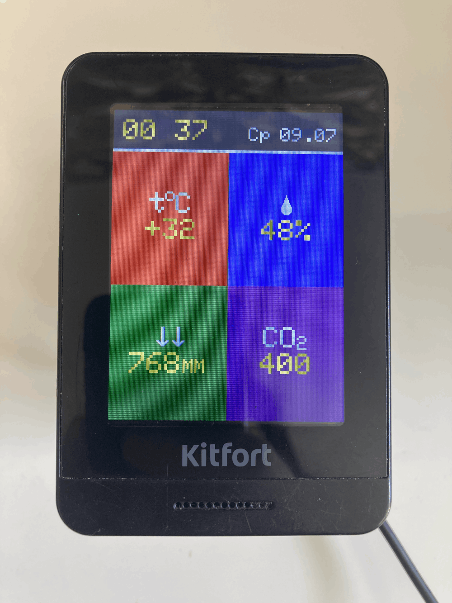
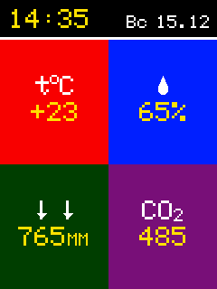
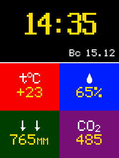
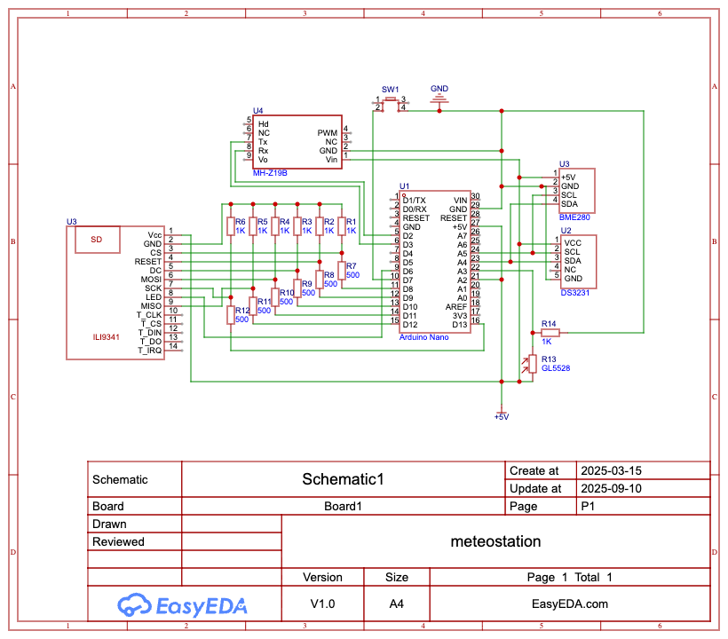

# MeteoClock — часы-метеостанция

Настольные часы с датчиками температуры, влажности, давления и CO₂. Данные выводятся на цветной TFT 320×240; время берётся с модуля RTC DS3231. Яркость экрана подстраивается под освещение, по кнопке — кратковременный максимум.

Основано на проекте [Алекса Гайвера](https://alexgyver.ru/meteoclock/).

---

## Что на экране

- **Время и дата** (русский календарь).
- **Температура** (°C), **влажность** (%), **давление** (мм рт. ст.), **CO₂** (ppm).
- Два варианта разметки:
  - **Оригинальный** — четыре квадранта (время в углу).
  - **Компактный** — крупные часы сверху, под ними квадранты датчиков. Время рисуется своим шрифтом 7×11 (масштаб 4), без грубого пиксельного масштабирования.

**Оригинальный стиль:**

**Компактный стиль:**

---

## Железо

| Компонент | Модель |
|-----------|--------|
| МК | Arduino Nano |
| RTC | DS3231 |
| Датчик T/H/P | BME280 |
| Датчик CO₂ | MH-Z19B |
| Дисплей | TFT 3.2" ILI9341 |
| Датчик освещённости | Фоторезистор GL5528 |

---

## Библиотеки (Arduino)

- Adafruit GFX, ILI9341, RTClib, Sensor, BME280  
- AlexGyver GTimer  
- MHZ19_uart  

Версии см. в комментариях/подключённых библиотеках в среде.

---

## Прошивка и настройка

1. Открыть `main.ino`, подключить библиотеки, собрать и прошить.
2. **Стиль экрана** — в начале файла один из двух:
   - `#define DISPLAY_STYLE_ORIGINAL 1` — четыре квадранта;
   - `#define DISPLAY_STYLE_COMPACT 1` — крупные часы сверху.
3. **Сброс RTC** (если нужно выставить время по дате компиляции):
   - Поставить `#define RESET_CLOCK 1`, прошить;
   - Поставить обратно `#define RESET_CLOCK 0`, прошить снова. Иначе при каждом включении часы будут сбрасываться.